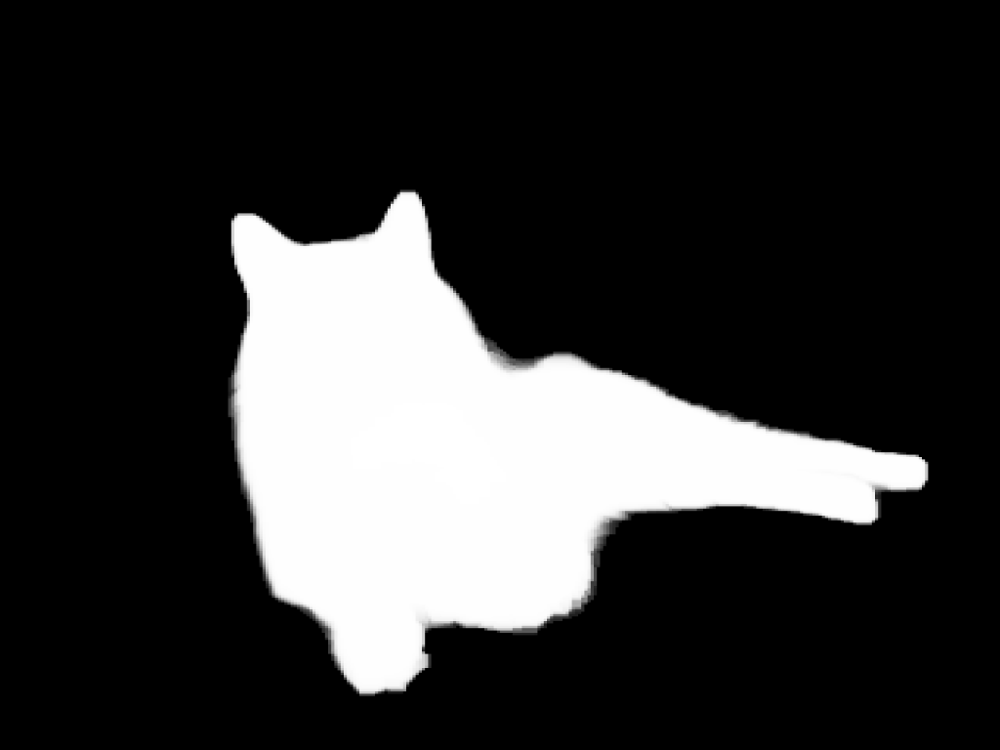

# furiends-ai-remove-background
```bash
python infer.py
```

Input Image             |  Output Mask          | Output Composed Image 
:-------------------------:|:-------------------------:|:-------------------------:
  |    |  